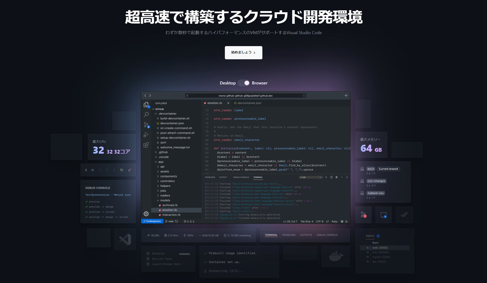

# GitHub Codespaces + Microsoft Azure 体験ハンズオン

## GitHub Codespaces について知る

[GitHub Codespaces](https://github.co.jp/features/codespaces) は、GitHub のプラットフォーム上でサポートされる、わずか数秒で起動する Visual Studio Code ベースの開発環境です。

※ 現在(2022年10月)の段階では、GitHub Team または GitHub Enterprise Cloud で利用する Organization の配下で利用できます。個人アカウントの場合、ベータ版の申請が受理された方は利用できです。なお、ベータ版の利用申請は、現在は申し込み口の公開が終了したようです。

### 特徴

- GitHub プラットフォーム上に立ち上げられた独立した環境
- 実態はコンテナだが、コンテナについての知識がなくても利用しやすい
- ブラウザまたは Visual Studio Code から利用できる
- ほとんどの Visual Studio Code の拡張機能を利用できる
- GitHub とのシームレスな連携
- Visual Studio Code のポートフォワーディング機能（`localhost` としてアクセス可能）に加え、パブリックまたは組織内のみ限定でURLとして公開できる
- 事前にビルドしておく機構を用いて、素早く環境を立ち上げられる
- 利用量（アクティブな時間とストレージ利用量）に従った課金
  - コンピュート SKU: 2 ～ 32 core、ストレージ: 1GB/month
- [Development Containers](https://containers.dev/) に則ったカスタマイズができる
  - [dev container features](https://containers.dev/features) を利用して簡単に機能追加ができる
  - 拡張機能のプリインストール
  - 任意のイメージ及び Dockerfile で構築できる

## Microsoft Azure について知る

- [Microsoft Azure](https://azure.microsoft.com/ja-jp/)

### このハンズオンで利用する範囲

- FaaS (Functions as a Service) である [Azure Functions](https://learn.microsoft.com/ja-jp/azure/azure-functions/functions-overview) を用いて、ローカルでの実行およびクラウド上のリソースにデプロイするまでをご紹介します。

## ハンズオン

### シナリオ

- GitHub Codespaces を立ち上げる
- 拡張機能を眺める（この時点では何もインストールされていない）
- `pre-built` ブランチから codespace を立ち上げてみる
- 拡張機能がインストールされていることを確認する
- `az` や `func` のコマンドがインストールされていることを確認する
- Azure Functions のプロジェクトを作成する
- GitHub Codespaces 上でローカル実行する
  - ポートフォワーディングにより、手元のマシンの `localhost` で接続できることを確認する
- 拡張機能で Azure にサインインする
- Functions のリソースを作成して、デプロイする

### ハンズオン資料

ご自身のペースで進められるハンズオン資料をご用意しています。[こちら](./docs/self-paced-hands-on.md)をご参考ください。

