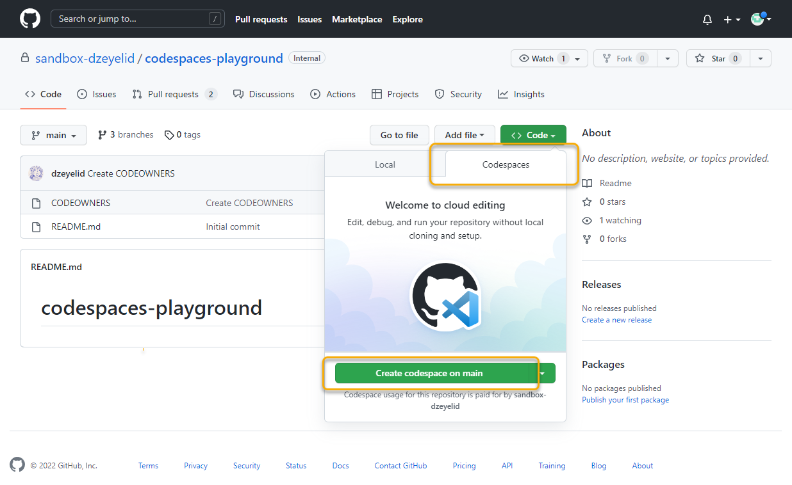
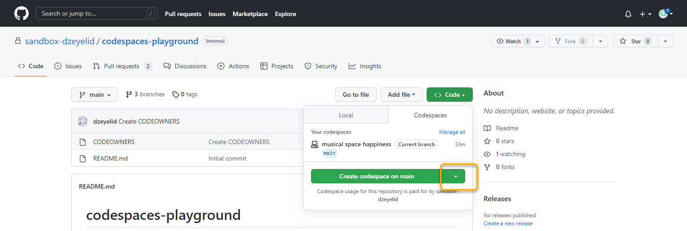
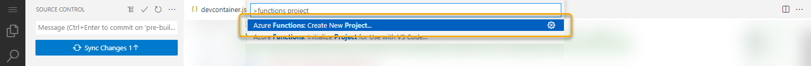
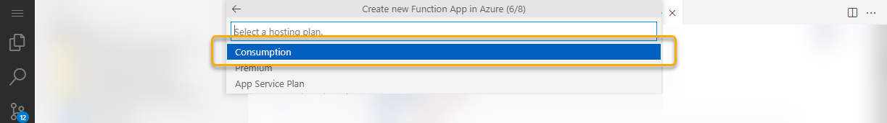
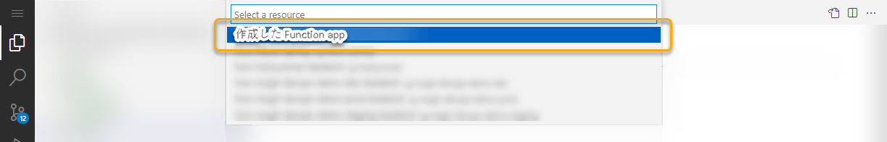
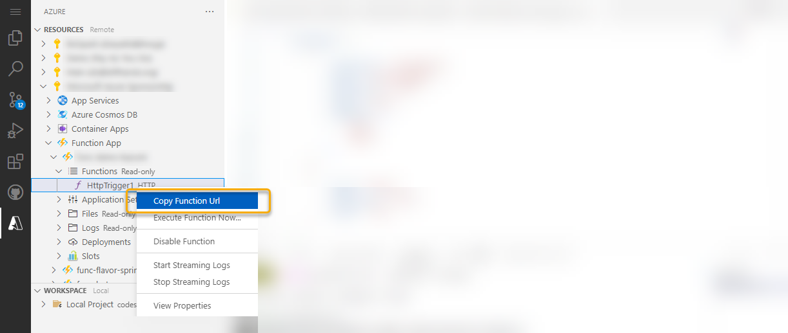

# セルフペース ハンズオン

このハンズオン資料は、Microsoft Ignite Spotlight on Japan の現地会場ハンズオンで利用するためにまとめられたものです。

ただし、事前準備の条件をクリアできる方は実施できる内容になっていますので、ご参考になれば幸いです。


## 事前準備

- GitHub アカウントを用意する
  - 個人アカウントの場合、GitHub Codespaces ベータ版の申請が受理されていること
  - もしくは、GitHub Codespaces が有効になっている（Spent limit が 0 より大きく設定されている）Organization に属していて、リポジトリを用意できること
- Microsoft Azure のアカウントを用意する


## 手順＆解説

### GitHub Codespaces を立ち上げる

それでは早速 GitHub Codespaces を立ち上げてみましょう！

リポジトリの「Code」ボタンを選択します。


すると、見慣れた「Local」とは別に「Codespaces」タブが有効になっているのが確認できます。「Create codespace on main」ボタンを選択します。



Codespaces は、ブラウザまたは Visual Studio Code で立ち上げることができます。後半、ポートフォワーディングの動作が双方で異なりますが、どちらもサポートするのでお好きな方で立ち上げてみてください。


このリポジトリのメインブランチには `devcontainer.json`（Development Containers の設定ファイル）がないので、GitHub Codespaces の default image で環境が立ち上がります。default image の詳細は、[vscode-dev-containers/containers/codespaces-linux](https://aka.ms/ghcs-default-image) をご参照ください。

default image は Ubuntu で構成されていて、`apt` を利用して追加のパッケージをインストールすることも可能です。また、主要な言語が含まれており、カスタマイズしなくても使える場合も多いです。テキストを書くだけなら、default image で事足ります。

default image は Visual Studio Code の拡張機能はインストールされていませんが、自由にインストールすることができます。

保存したファイルやインストールしたパッケージ、インストールした拡張機能は、その codespace のインスタンスを消すまでは保持されます。

今回は、Azure Functions の開発を行いたいのですが、今ここで必要なパッケージや拡張機能をインストールしていると時間がかかってしまうので、"すでに用意されているイメージ" を使った環境を立ち上げてみましょう。


### Prebuild が設定されたブランチから codespace を立ち上げてみる

リポジトリの「Code」ボタンを再度開き、「Create codespace on main」の横の矢印ボタンを選択します。



「Configure and create codespace」を選択します。


ボタンが「Configure and crate codespace」に変わるので、それを選択します。


GitHub Codespaces は、起動するオプションを選ぶことができます。今回は、事前に用意しておいた `pre-built` ブランチで起動してみましょう。

- ブランチ
- 参照する Dev container の設定ファイル
- codespace を配置するリージョン
- SKU（コア数、メモリ、ストレージ量）


`pre-built` ブランチには、`.devcontainer/devcontainer.json` と `.devcontainer/Dockerfile` が含まれており、このファイルがあると Codespaces はその設定をもとにイメージをビルドした上で環境を起動します。


さて、お気づきでしょうか？即座に立ち上がりましたね？

実は、リポジトリの設定で GitHub Codespaces の Prebuild という機能を設定しておくことで、先にイメージをビルドしておくことができます。利用するリージョンにイメージを保存しておいてくれるので、すぐダウンロードが終わり起動することができるのです。

この Dev container の設定は、とても簡単にベースを作成できます。

メニューから「View」→「Command Palette...」を開き、`Codespaces: Add Dev Container Configuration Files...` を選択してみましょう。


すると、設定の定義一覧が表示されます。`Show All Definitions...` からすべての定義を表示し、`Azure Functions & Node.js` をみつけてみてください。


これが今開いてもらっている `pre-built` ブランチで利用している Dev container の設定のベースです。私はこの設定のうち、Node.js のバージョンだけを `16` に変更して利用しています。

この `Azure Functions & Node.js` イメージには、Azure Functions の開発に必要なパッケージや拡張機能が事前にインストールされています。

ターミナルを開き、`az` や `func` コマンドを確認してみましょう。また、拡張機能の一覧を開き、「CODESPACES - INSTALLED」に「[Azure Account](https://marketplace.visualstudio.com/items?itemName=ms-vscode.azure-account)」や「[Azure Functions](https://marketplace.visualstudio.com/items?itemName=ms-azuretools.vscode-azurefunctions)」がインストールされていることが確認できます。


> **Note** このハンズオンでは機能説明をしやすいようにデフォルトではないブランチに prebuild を設定していますが、実際に利用するときは、デフォルトブランチ（`main`）に設定する方が直感的で、プロジェクトのメンバーがより早く環境にアクセスできるようになるでしょう。


### Azure Functions のプロジェクトを作成する

それではさっそく Azure Functions の開発に着手しましょう！

まず、今は `pre-built` ブランチが開かれているので、作業用のブランチに切替え、作業用のディレクトリを作成しておきましょう。メニューから「Terminal」→「New Terminal」を開き、下記を実行します。

```
git switch -c add-functions
mkdir functions
```

つぎに、拡張機能を用いて Azure Functions の新規プロジェクトを生成しましょう。Command Palette で、`Azure Functions: Create New Project...` を選択します。



ファイルを配置するディレクトリを問われるので、`Browse...` で先ほど作成した `functions` ディレクトリを選択してください。


言語の選択では、Functions を記述する言語を選択します。ここでは `JavaScript` を選択します。

つぎに、最初の関数のテンプレートを選択します。ここでは、API を作成したので、`HTTP trigger` を選択しましょう。

HTTP trigger の名前は、そのまま決定（`Enter`キー押下）しておきます。

認証レベルは `Anonymous` を選択しておきましょう。


これで `HttpTrigger1` という HTTP trigger 関数が作成されました。


### GitHub Codespaces 上でローカル実行する

まずはローカル（ここでは GitHub Codespaces インスタンス上）で Azure Functions を実行してみましょう。

すでに、デバッグ用の設定ファイルが配置されているので、F5キー押下、またはデバッグペインからすぐデバッグ実行ができます。

すると Function Runtime のログが表示され起動されたら、API にアクセスしてみましょう。

Visual Studio Code で作業されている方は、`http://localhost:7071/api/HttpTrigger1` にアクセスしてみてください。

ブラウザで作業されている方は、ポートフォワーディングの設定を public に設定して開くアクセスできることを試してみましょう。ターミナルを開いているペインのタブで「PORTS」を選択し、`7071` の行を右クリックし表示されたメニューで「Port Visibility」→「Public」を選択することで、接続用のURLが発行されるのでそれを用いてアクセスします。`http://localhost:<port>` の部分を置き換え、 `https://<public url>/api/HttpTrigger1` にアクセスしてみてください。

> **Note** GitHub Codespaces を Organization で利用している場合は、Port Visibility の「Private to Organization」を選択することで、Organization の認証が済んだセッション内でURLを利用できるようになります。

> **Note** これらの ポートフォワーディングの「Port Visibility」の設定は、ブラウザ及び Visual Studio Code どちらでも利用可能です。

`/api/HttpTrigger1` にアクセスすると、先ほど生成した HTTP trigger 関数が呼び出されレスポンスを返却していることがわかります。

これで、あたかも手元の環境で作業しているかのようにスムーズに開発できることを体験いただけたかと思います。

また、この環境は GitHub Codespaces 内に閉じられ、手元の環境に影響しないこともメリットの一つでしょう。


###　Azure Functions を Microsoft Azure にデプロイする

それでは最後に、作成した Azure Functions のプロジェクトを、Microsoft Azure にデプロイしてみましょう！

Azure Functions のデプロイはいくつかの方法がありますか、今回は拡張機能[Azure Account](https://marketplace.visualstudio.com/items?itemName=ms-vscode.azure-account)」と「[Azure Functions](https://marketplace.visualstudio.com/items?itemName=ms-azuretools.vscode-azurefunctions)」を利用します。

まず、拡張機能で Microsoft Azure にログインします。Command Palette を開き、`Azure: Sign in` または `Azure: Sign in with Device Code` を実行して Azure にログインしましょう。前者はアクティブなブラウザでログイン画面が開き認証を促されます。もし、アクティブなブラウザのセッションがサインインしたいアカウントと異なる場合、後者の方式でデバイスコードを用いてサインインを行なってください。


サインインができたら、Azure Functions のリソース（Function App）を作成するために、Command Palette で `Azure Functions: Create Function App in Azure... (Advanced)` を選択します。


使用するサブスクリプションを選択します。


「Create new Function App in Azure (1/7)」で、作成する Function App リソース名を入力します。Function App のリソース名は、グローバルで一位である必要があります。（誰とも被ってはいけません）


「Create new Function App in Azure (2/7)」では、ランタイムスタックを選択します。ここでは、「Node.js 16 LTS」を選択してください。


「Create new Function App in Azure (3/8)」では、Function App のベースとする OS を選択します。ここでは、`Linux` を選択します。


「Create new Function App in Azure (4/8)」では、Function App を配置するリソースグループを指定します。招待されているリソースグループを選択してください。


「Create new Function App in Azure (5/8)」では、リソースを配置するリージョンを選択しましょう。リージョンはそのリソースを利用するユーザーの地域に近いところを選択することが一般的です。


「Create new Function App in Azure (6/8)」では、課金体系を選択します。ここでは `Consumption` （従量課金）を選択します。



「Create new Function App in Azure (7/8)」では、Function App の稼働のための保存領域としてのストレージアカウントを指定します。「+ Create new storage account」を選択し、任意の名前を指定します。ここでは、提示されたままの名前で進めてください。


「Create new Function App in Azure (9/9)」では、モニタリングに使用する Aplication Insights のリソースを指定します。ここでは、「Skip for now」を選択し進めてください。


Function App の作成が完了したら、いよいよプロジェクトをデプロイしましょう。

Command Palette で `Azure Functions: Deploy to Function App...` を実行してください。


使用するサブスクリプションを選択します。

Function App のリソース一覧が表示されるので、先ほど作成した Function App を選択します。



「先にデプロイしたものを上書きするがよいか？」というポップアップが表示されるので、「Deploy」ボタンを選択して進めてください。


デプロイが終わるまでしばらく待ちます。

デプロイが終わったら、左のメニューの Azure （Aのマーク）を開き、リソースを確認してみましょう。

「RESOURCES」の一覧を辿っていくと、先ほどデプロイした関数を確認することができます。


HTTP trigger として作成した関数「HttpTrigger1」を右クリックしメニューから「Copy Function Url」を選択します。



このようなURL `https://<function app name>.azurewebsites.net/api/httptrigger1` がコピーされ、それを実行すると先ほど作成した関数が動作していることが確認できます。


Congratulations!🎉

